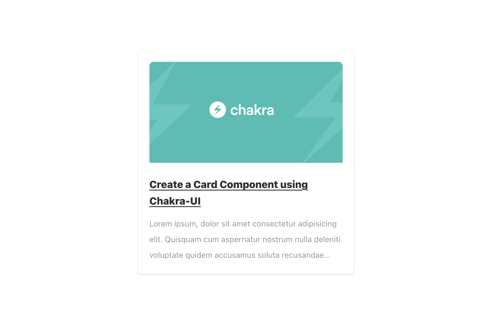

# Built to showcase the ease and possibilities of building with Chakra-UI

You can find the Hashnode Article here: [Create a Card Component Using Chakra-UI](https://www.gatsbyjs.com/docs/?utm_source=starter&utm_medium=readme&utm_campaign=minimal-starter)

